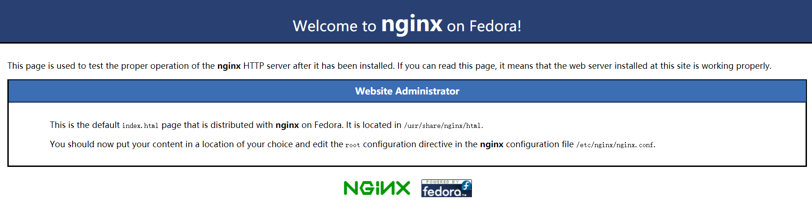

nginx 是一款高性能 web 服务器，很多技术场景都需要它。本篇整理一下在最火的 Linux 发行版 CentOS 7 上安装 nginx 的具体步骤。

---

## nginx 安装与启动

1. 添加 CentOS 7 EPEL repository
   > sudo yum install epel-release
2. 安装 nginx
   > sudo yum install nginx
3. 启动 nginx
   > sudo systemctl start nginx
4. 修改防火墙，对外暴露 http 与 https 服务

   ```shell
   sudo firewall-cmd --permanent --zone=public --add-service=http
   sudo firewall-cmd --permanent --zone=public --add-service=https
   sudo firewall-cmd --reload
   ```

   到此为止，你已经可以访问服务器的域名或 ip 来看看效果了。如果看到下面这样的页面，就说明 nginx 已经正常启动工作了。

   

5. 可以让 nginx 开机自启
   > sudo systemctl enable nginx

## nginx 的几个重要目录

- nginx 默认的静态页面的目录 `/usr/share/nginx/html`
- nginx 默认的虚拟主机配置目录 `/etc/nginx/conf.d`
  - 向该目录中添加`.conf`扩展名的文件就可以添加一台虚拟主机
  - 虚拟主机在 nginx 启动时，读取该目录中的`.conf`配置后自动创建
- nginx 默认的全局配置文件路径 `/etc/nginx/nginx.conf`
